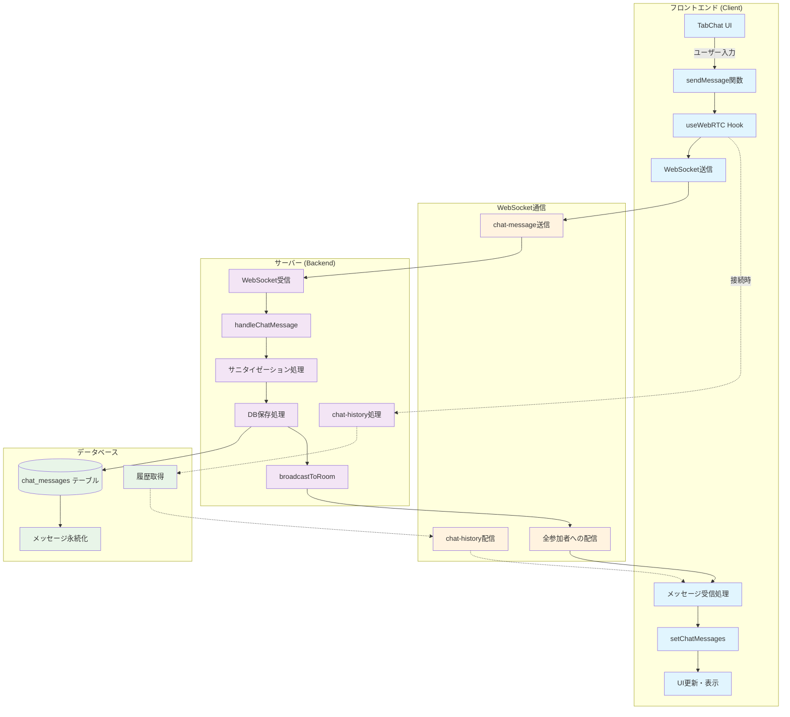

```mermaid
flowchart TB
    %% チャット機能の処理フロー分析
    
    subgraph "フロントエンド (Client)"
        A1[TabChat UI]
        A2[sendMessage関数]
        A3[useWebRTC Hook]
        A4[WebSocket送信]
        A5[メッセージ受信処理]
        A6[setChatMessages]
        A7[UI更新・表示]
    end
    
    subgraph "WebSocket通信"
        WS1[chat-message送信]
        WS2[全参加者への配信]
        WS3[chat-history配信]
    end
    
    subgraph "サーバー (Backend)"
        B1[WebSocket受信]
        B2[handleChatMessage]
        B3[サニタイゼーション処理]
        B4[DB保存処理]
        B5[broadcastToRoom]
        B6[chat-history処理]
    end
    
    subgraph "データベース"
        DB1[(chat_messages テーブル)]
        DB2[メッセージ永続化]
        DB3[履歴取得]
    end
    
    %% 送信フロー
    A1 -->|ユーザー入力| A2
    A2 --> A3
    A3 --> A4
    A4 --> WS1
    WS1 --> B1
    B1 --> B2
    B2 --> B3
    B3 --> B4
    B4 --> DB1
    DB1 --> DB2
    B4 --> B5
    
    %% 配信フロー  
    B5 --> WS2
    WS2 --> A5
    A5 --> A6
    A6 --> A7
    
    %% 履歴取得フロー
    A3 -.->|接続時| B6
    B6 -.-> DB3
    DB3 -.-> WS3
    WS3 -.-> A5
    
    %% スタイリング
    classDef frontend fill:#e1f5fe
    classDef backend fill:#f3e5f5  
    classDef database fill:#e8f5e8
    classDef websocket fill:#fff3e0
    
    class A1,A2,A3,A4,A5,A6,A7 frontend
    class B1,B2,B3,B4,B5,B6 backend
    class DB1,DB2,DB3 database
    class WS1,WS2,WS3 websocket
```
